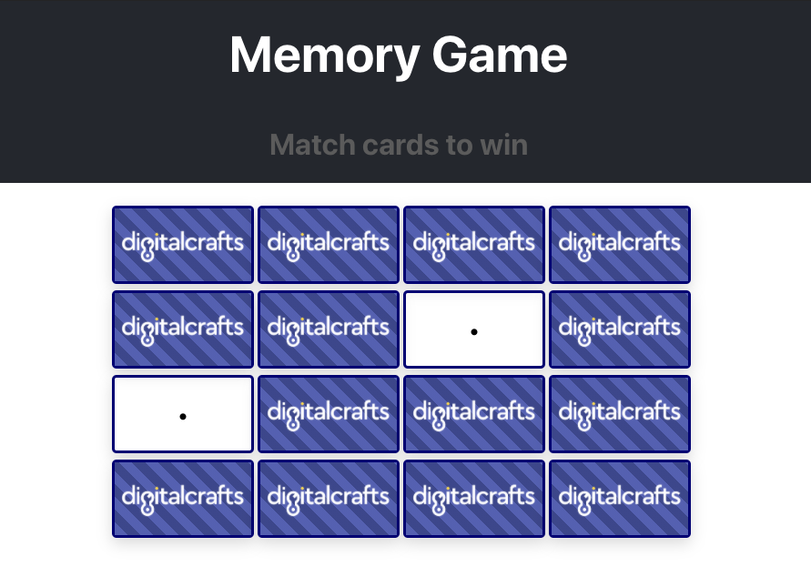

# Memory Game - DigitalCrafts

Classic memory game where a player has a set of cards that are face down. A player then choses two cards to be flipped over. If the two cards have matching symbols, that player has correctly identified the pair. If the two cards are different, both cards are then flipped back over faced down and the play will select two more cards, trying each time to select a pair with the same symbol on them.

## Screenshots

## Tech/framework Used

-   React.js
